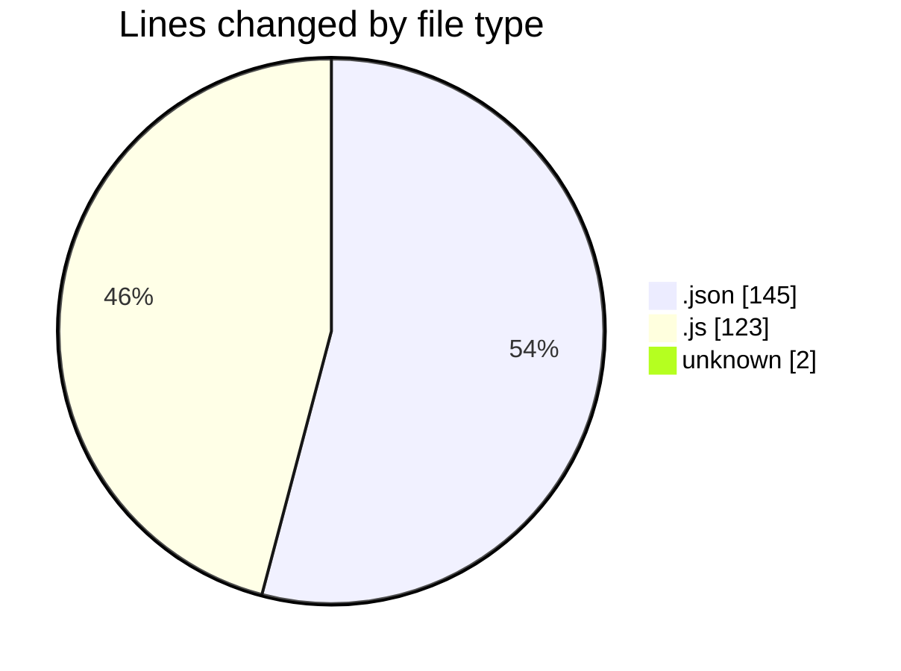
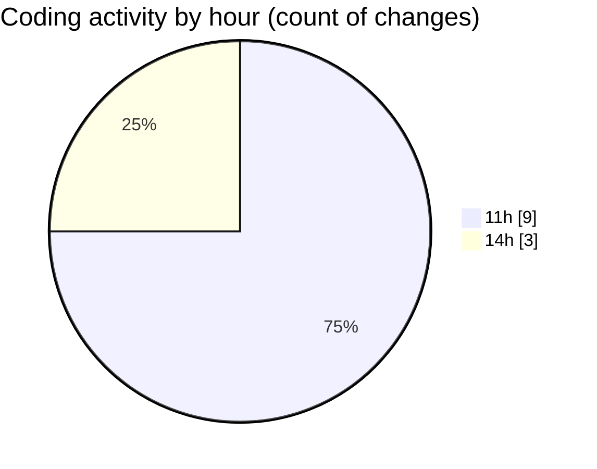

# mono-test - Activity Summary 

## Overall Statistics

| Stat                   | Value                                                             |
| ---------------------- | ----------------------------------------------------------------- |
| **Lines Added** (➕)   | 253                                          |
| **Lines Removed** (➖) | 17                                        |
| **Net Change** (↕)    | 236                |
| **Active Time** (⌚)   | 10 minutes |

## Modified Files
- **settings.json** (+143, -2)
- **main.js** (+108, -15)
- **COMMIT_EDITMSG** (+2, -0)

## Visualizations

### By File Type (Lines Changed)

### By Hour (Estimated Activity Count)

> **Last Updated:** 2026/8/1 14:09:58